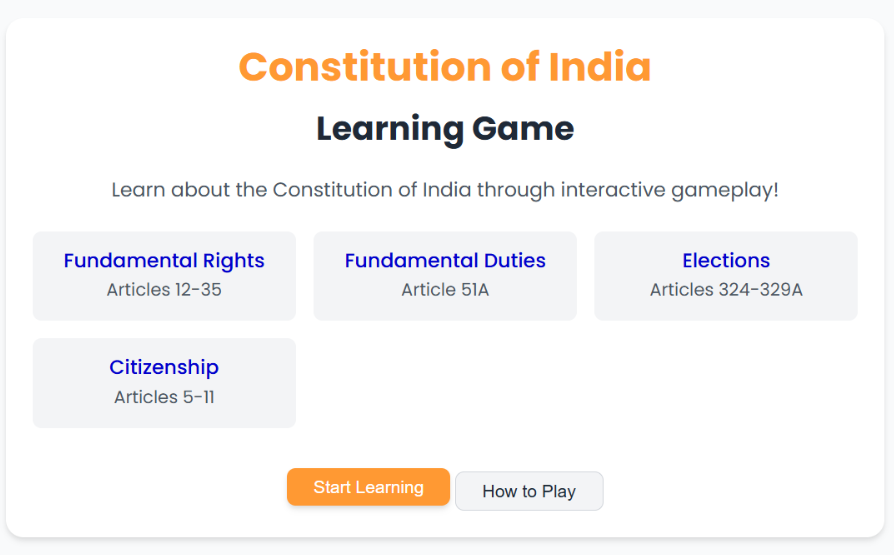
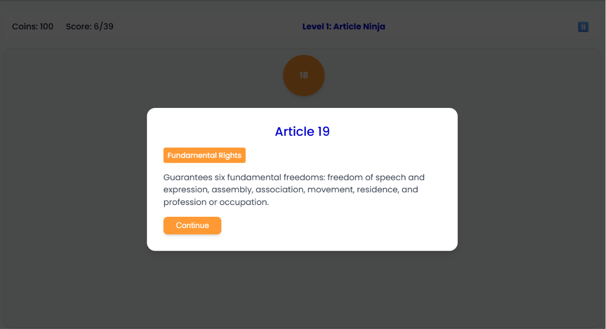
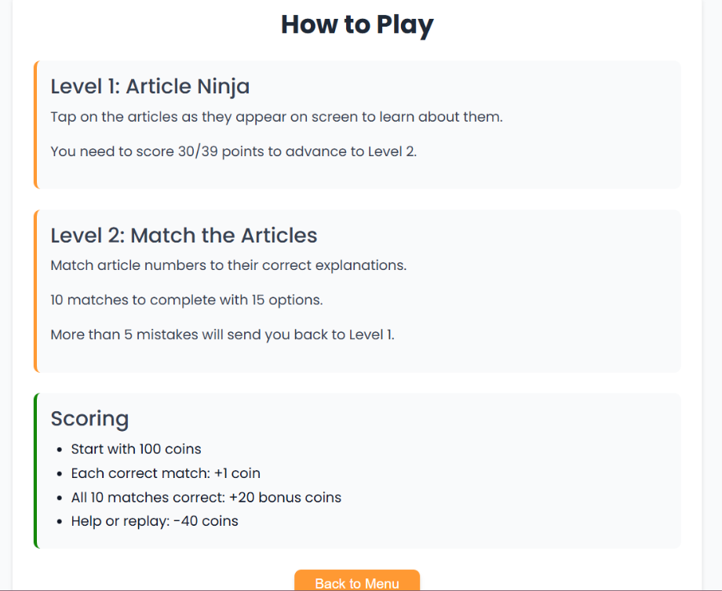
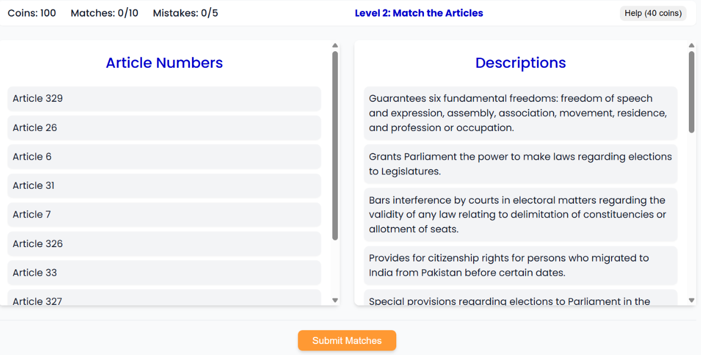

---
## 📖 Project Overview

The Constitution of India Learning Game is designed to simplify constitutional learning by replacing traditional reading methods with an interactive, game-based approach.

Players progress through multiple levels where they first learn constitutional articles and then test their understanding through matching challenges. The application covers important constitutional topics including **Fundamental Rights, Citizenship, and Elections**.

## Screenshots
### Home Page

The main landing page where users can explore constitutional topics and begin their learning journey.



---

### Level 1 – Interactive Bubble Learning

Players learn the Constitution by clicking on colorful numbered bubbles. Each bubble opens the corresponding constitutional article along with its explanation. After reading, users click **Continue** to proceed until all **40 articles** are completed.



---

### How to Play

The application provides clear instructions explaining the gameplay, levels, scoring system, and progression.



---

### Level 2 – Article Matching Challenge

After completing Level 1, players unlock Level 2, where they match constitutional articles with their correct descriptions. Players begin with **100 coins**, and hints are available for **40 coins** each. A qualifying score is required to complete the game successfully.




## Gameplay

### Level 1 – Learn Through Interactive Bubbles

The game begins with **40 colorful numbered bubbles**, where each bubble represents an important constitutional article.

Each constitutional category is color-coded for easy identification:

### How it Works

- Click a numbered bubble.
- The corresponding constitutional article and its explanation appear.
- Read the content to understand the concept.
- Click **Continue** to proceed.
- Repeat until all **40 bubbles** have been completed.

This level helps users build a strong understanding of constitutional articles before moving on to the assessment stage.
### Level 2 – Match the Articles

After completing all 40 articles, players unlock **Level 2**.

In this level, players must match constitutional articles with their correct descriptions.

Example:

| Article | Description |
|---------|-------------|
| Article 14 | Equality Before Law |
| Article 19 | Freedom of Speech |
| Article 21 | Right to Life and Personal Liberty |

Players submit their answers after completing all matches.

## Coin & Hint System

To make gameplay more engaging, the application includes a virtual coin system.

-  Every player starts with **100 coins**
-  A hint costs **40 coins**
- Players can spend coins if they need help answering a question in Level 2

This encourages strategic thinking while keeping the game challenging.

##  Qualification Criteria

Players must achieve the required qualifying score in Level 2.

-  Pass → Successfully complete the game.
-  Fail → Restart from **Level 1** to review the constitutional articles before attempting the quiz again.

This reinforcement-based learning approach helps improve memory and understanding.

##  Features

-  Interactive bubble-based learning
- Color-coded constitutional categories
- Article-by-article learning experience
- Article-to-description matching game
- Coin and hint system
- ualification-based progression
- Responsive and user-friendly interface
- Educational and gamified learning

## Tech Stack

- React
- TypeScript
- Vite
- Tailwind CSS
- HTML5
- CSS3
- JavaScript
--- 
## Getting Started

```bash
git clone https://github.com/umasri2006/constitutional-gaming-app.git

cd constitutional-gaming-app

npm install

npm run dev
```

Visit:

```
http://localhost:5173
```

GitHub: https://github.com/umasri2006